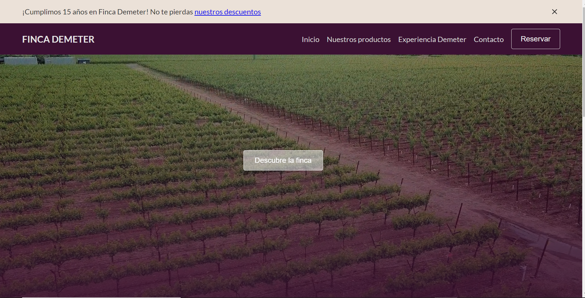

# <h1> Trabajo Práctico - Programa Codo a Codo</h>

## <h2>Página web "Finca Demeter"</h2>

## Autores

Walter Horacio Coria
Cintia Molina
Maximiliano Leonel Pérez

## Github repo

Este es el repositorio [link](https://github.com/finca-demeter-web/grupo_17_finca-demeter)

## Sitio Web

El deploy esta en el siguiente link [link](https://fincademeter.vercel.app/)

## Tech Stack

**Client:** HTML, CSS, Vanilla JavaSCript

## Tools Utilizadas

- [Imágenes y video](https://unsplash.com/) En el inicio y otras imágenes
- [Imágenes](https://www.google.com/) En los productos y galerías de imágenes
- [Icons](https://boxicons.com/) Los iconos de las redes sociales
- [Iframe]("https://www.google.com/maps/") El mapa de google
- [API](https://randomuser.me/) API de usuarios para la sección comunidad
- [API Python](https://maxoleodev.pythonanywhere.com/) API de vinos hecha con Python, Flask y MySQL

## Estructura de carpeta

El index.html, readme, las páginas html principales y estilos son los archivos en el root folder.

La carpeta assets contiene icons, imagenes y videos.

La carpeta pages contiene el html de la página de contacto.
